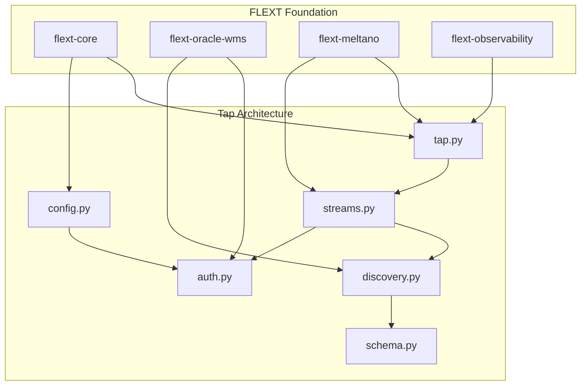
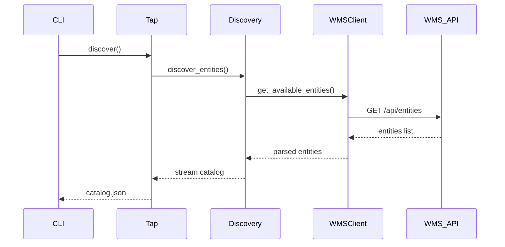
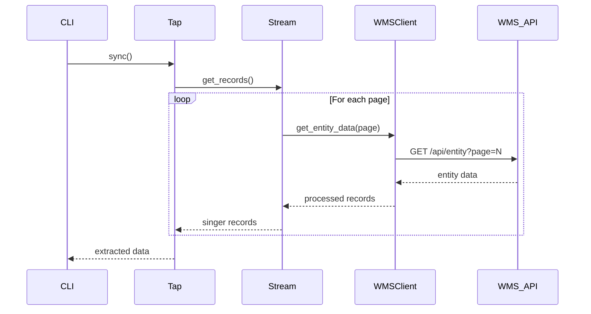

# Architecture Documentation

## Overview

FLEXT Tap Oracle WMS implements a Singer-compliant data extraction tap for Oracle Warehouse Management Systems. This document provides comprehensive architectural analysis of the current implementation and target architecture after refactoring.

## Current Architecture Issues

### Critical Problems Identified

1. **Massive Over-Engineering**: 26 Python components for simple Singer tap functionality
2. **Architectural Violations**: Multiple competing patterns without clear boundaries
3. **Code Duplication**: Redundant implementations across discovery and configuration systems
4. **Test Infrastructure Breakdown**: 27% of tests disabled due to external dependencies

### Current Component Structure

```
src/flext_tap_oracle_wms/
├── tap.py                      # Main tap implementation (over-complex)
├── streams.py                  # Stream definitions (over-engineered)
├── client.py                   # Unnecessary wrapper around flext-oracle-wms
├── auth.py                     # Authentication handling
├── config.py                   # Configuration models
├── config_mapper.py            # Configuration mapping layer (redundant)
├── config_validator.py         # Configuration validation
├── discovery.py                # Legacy discovery implementation
├── modern_discovery.py         # "Modern" discovery (redundant)
├── entity_discovery.py         # Third discovery system (redundant)
├── schema_generator.py         # Schema generation
├── schema_flattener.py         # Schema flattening utilities
├── type_mapping.py
├── cache.py                    # Response caching
├── simple_api.py               # Simplified API interface
├── critical_validation.py      # Environment validation
├── domain/                     # Domain layer
│   ├── models.py               # Domain models
│   ├── types.py                # Domain types
│   └── __init__.py
├── interfaces.py               # Interface definitions
├── models.py                   # Additional models (duplication)
├── exceptions.py               # Custom exceptions
└── __version__.py              # Version information
```

**Problems**:

- **26 components** where 6-8 would suffice
- **8,179 lines** of code vs expected 400-800 lines
- **Multiple discovery systems** competing for the same functionality
- **Configuration chaos** with 4 different configuration approaches

## Target Architecture

### Simplified Component Structure

```
src/flext_tap_oracle_wms/
├── tap.py                      # Main tap class (Singer SDK compliant)
├── streams.py                  # Stream definitions (simplified)
├── config.py                   # Single configuration system
├── discovery.py                # Unified discovery implementation
├── auth.py                     # Authentication (using flext-oracle-wms)
├── schema.py                   # Schema handling utilities
├── exceptions.py               # Project-specific exceptions
└── __version__.py              # Version information
```

**Benefits**:

- **8 components** vs current 26 (69% reduction)
- **~800 lines** vs current 8,179 (90% reduction)
- **Single responsibility** per component
- **Clear dependency flow** following Clean Architecture

### Architecture Layers

#### 1. Presentation Layer

- **tap.py**: Singer SDK tap implementation
- **CLI interface**: Command-line interface for tap operations

#### 2. Application Layer

- **streams.py**: Stream orchestration and data flow
- **discovery.py**: Entity and schema discovery coordination

#### 3. Domain Layer

- **config.py**: Configuration domain models and validation
- **schema.py**: Schema transformation and validation logic

#### 4. Infrastructure Layer

- **auth.py**: Authentication using flext-oracle-wms library
- **flext-oracle-wms**: External WMS API client (dependency)

### FLEXT Ecosystem Integration



**Integration Points**:

- **flext-core**: Base patterns, logging, result handling, type system
- **flext-oracle-wms**: WMS API client, authentication, entity models
- **flext-meltano**: Singer SDK integration, orchestration patterns
- **flext-observability**: Monitoring, metrics, health checks

## Design Patterns

### 1. Clean Architecture Compliance

**Dependency Rule**: Dependencies point inward toward domain layer

```python
# Domain Layer (core business logic)
class WMSEntityConfig:
    entity_name: str
    replication_method: str
    fields: List[str]

# Application Layer (orchestration)
class EntityDiscovery:
    def __init__(self, wms_client: WMSClient, config: WMSEntityConfig):
        self._wms_client = wms_client
        self._config = config

# Infrastructure Layer (external dependencies)
class WMSAuthenticator:
    def __init__(self, flext_wms_client: FlextOracleWmsClient):
        self._client = flext_wms_client
```

### 2. Singer SDK Integration

**Stream Pattern**: Standard Singer SDK stream implementation

```python
from singer_sdk import Tap
from singer_sdk.streams import RESTStream

class FlextTapOracleWMS(Tap):
    name = "tap-oracle-wms"
    config_jsonschema = WMSConfigSchema.model_json_schema()

    def discover_streams(self) -> List[Stream]:
        """Discover available streams from WMS API."""
        return [
            FlextTapOracleWMSStream(tap=self, name=entity, path=f"/api/{entity}")
            for entity in self.config["entities"]
        ]

class FlextTapOracleWMSStream(RESTStream):
    """Standard Singer stream for WMS entities."""

    def get_records(self, context):
        """Extract records using flext-oracle-wms client."""
        for record in self.wms_client.get_entity_data(self.name):
            yield record
```

### 3. Configuration Management

**Single Source of Truth**: Unified configuration system

```python
from pydantic import BaseModel, Field
from flext_core import FlextConfig

class WMSConfig(FlextConfig):
    """Unified WMS tap configuration."""

    base_url: str
    auth_method: str = Field(..., regex="^(basic|oauth2)$")
    company_code: str
    facility_code: str
    entities: List[str] = Field(default_factory=lambda: ["item", "inventory"])

    # Authentication fields
    username: Optional[str] = None
    password: Optional[str] = None
    oauth_client_id: Optional[str] = None
    oauth_client_secret: Optional[str] = None

    @validator("entities")
    def validate_entities(cls, v):
        """Validate entity names against WMS API."""
        valid_entities = ["item", "location", "inventory", "order", "shipment"]
        invalid = set(v) - set(valid_entities)
        if invalid:
            raise ValueError(f"Invalid entities: {invalid}")
        return v
```

## Data Flow Architecture

### 1. Discovery Flow



### 2. Extraction Flow



## Performance Architecture

### 1. Pagination Strategy

```python
class WMSPaginator:
    """Simplified pagination for Oracle WMS HATEOAS."""

    def __init__(self, page_size: int = 1000):
        self.page_size = min(page_size, 1250)  # WMS limit

    def get_next_url(self, response: Dict) -> Optional[str]:
        """Extract next page URL from HATEOAS links."""
        return response.get("links", {}).get("next")
```

### 2. Caching Strategy

```python
from functools import lru_cache
from typing import Dict

class WMSCache:
    """Simple LRU cache for WMS responses."""

    @lru_cache(maxsize=1000)
    def get_entity_schema(self, entity_name: str) -> Dict[str, object]:
        """Cache entity schemas for discovery."""
        return self._fetch_schema(entity_name)
```

### 3. Connection Management

```python
from flext_oracle_wms import FlextOracleWmsClient

class WMSConnectionManager:
    """Manage WMS connections using flext-oracle-wms."""

    def __init__(self, config: WMSConfig):
        self.client = FlextOracleWmsClient(
            base_url=config.base_url,
            auth_method=config.auth_method,
            # ... other config
        )

    def get_client(self) -> FlextOracleWmsClient:
        """Get configured WMS client."""
        return self.client
```

## Error Handling Architecture

### 1. Exception Hierarchy

```python
from flext_core import FlextExceptions.Error

class WMSTapError(FlextExceptions.Error):
    """Base exception for WMS tap errors."""
    pass

class WMSAuthenticationError(WMSTapError):
    """WMS authentication failures."""
    pass

class WMSEntityNotFoundError(WMSTapError):
    """WMS entity not found or not accessible."""
    pass

class WMSSchemaError(WMSTapError):
    """WMS schema validation errors."""
    pass
```

### 2. Error Recovery

```python
import time
from typing import Iterator

def retry_with_backoff(max_retries: int = 3, base_delay: float = 1.0):
    """Decorator for retry logic with exponential backoff."""
    def decorator(func):
        def wrapper(*args, **kwargs):
            for attempt in range(max_retries):
                try:
                    return func(*args, **kwargs)
                except (WMSAuthenticationError, ConnectionError) as e:
                    if attempt == max_retries - 1:
                        raise
                    delay = base_delay * (2 ** attempt)
                    time.sleep(delay)
            return None
        return wrapper
    return decorator
```

## Testing Architecture

### 1. Test Structure

```
tests/
├── unit/                       # Unit tests for isolated components
│   ├── test_tap.py            # Tap class testing
│   ├── test_streams.py        # Stream testing with mocks
│   ├── test_config.py         # Configuration validation
│   └── test_discovery.py      # Discovery logic testing
├── integration/               # Integration tests with WMS API mocks
│   ├── test_wms_integration.py # Full integration scenarios
│   └── test_singer_compliance.py # Singer protocol compliance
├── fixtures/                  # Test data and fixtures
│   ├── wms_responses.json     # Mock WMS API responses
│   └── config_samples.json    # Configuration examples
└── conftest.py                # Pytest configuration and fixtures
```

### 2. Mock Strategy

```python
import pytest
from unittest.mock import Mock, patch
from flext_oracle_wms import FlextOracleWmsClient

@pytest.fixture
def mock_wms_client():
    """Mock WMS client for testing."""
    client = Mock(spec=FlextOracleWmsClient)
    client.get_entities.return_value = ["item", "inventory", "order"]
    client.get_entity_data.return_value = [
        {"id": "1", "name": "Test Item"},
        {"id": "2", "name": "Another Item"}
    ]
    return client

def test_stream_extraction(mock_wms_client):
    """Test stream data extraction with mocked client."""
    with patch('flext_tap_oracle_wms.streams.get_wms_client', return_value=mock_wms_client):
        stream = FlextTapOracleWMSStream(tap=mock_tap, name="item")
        records = list(stream.get_records(None))
        assert len(records) == 2
        assert records[0]["id"] == "1"
```

## Security Architecture

### 1. Authentication Integration

```python
from flext_oracle_wms import WMSAuthenticator

class TapAuthentication:
    """Delegate authentication to flext-oracle-wms library."""

    def __init__(self, config: WMSConfig):
        self.authenticator = WMSAuthenticator(
            auth_method=config.auth_method,
            credentials=self._extract_credentials(config)
        )

    def get_authenticated_client(self):
        """Get authenticated WMS client."""
        return self.authenticator.get_client()
```

### 2. Configuration Security

```python
from pydantic import SecretStr

class SecureWMSConfig(WMSConfig):
    """Secure configuration with secret handling."""

    password: Optional[SecretStr] = None
    oauth_client_secret: Optional[SecretStr] = None

    def get_credentials(self) -> Dict[str, str]:
        """Get credentials with secret values."""
        creds = {}
        if self.password:
            creds["password"] = self.password.get_secret_value()
        if self.oauth_client_secret:
            creds["client_secret"] = self.oauth_client_secret.get_secret_value()
        return creds
```

## Migration Strategy

### Phase 1: Emergency Simplification (Week 1)

1. Remove redundant discovery systems (keep one)
2. Eliminate client.py wrapper layer
3. Consolidate configuration classes
4. Re-enable critical disabled tests

### Phase 2: Structural Refactoring (Weeks 2-3)

1. Implement simplified component structure
2. Integrate flext-core patterns consistently
3. Create comprehensive test coverage
4. Validate Singer compliance

### Phase 3: Performance Optimization (Week 4)

1. Optimize stream performance
2. Implement proper error handling
3. Add comprehensive monitoring
4. Complete documentation

## Quality Metrics

### Target Metrics

- **Code Lines**: < 1,000 lines (from 8,179)
- **Components**: 6-8 files (from 26)
- **Test Coverage**: 95% (from ~70% with disabled tests)
- **Cyclomatic Complexity**: < 10 per function
- **Type Coverage**: 100% with strict MyPy

### Quality Gates

- All tests passing (no disabled tests)
- Zero security vulnerabilities
- 100% Singer protocol compliance
- Full FLEXT ecosystem integration
- Comprehensive documentation

---

**Status**: Architecture Defined | **Next**: Implementation of simplified architecture | **Updated**: 2025-08-13
