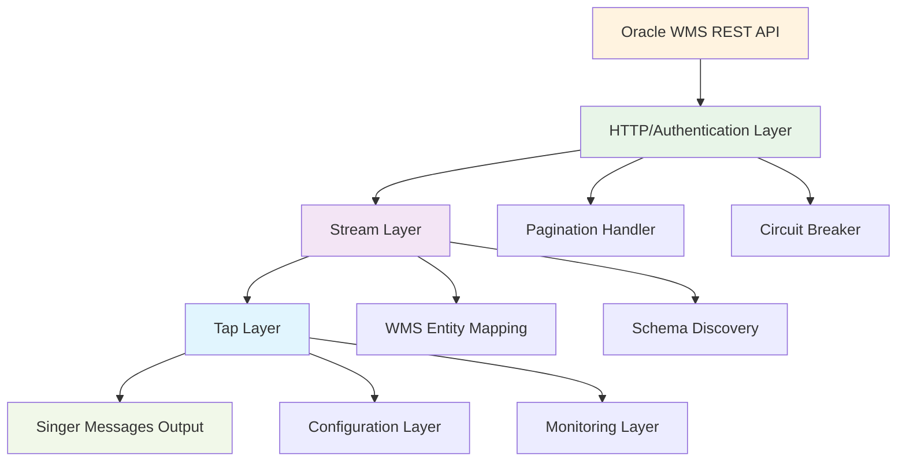
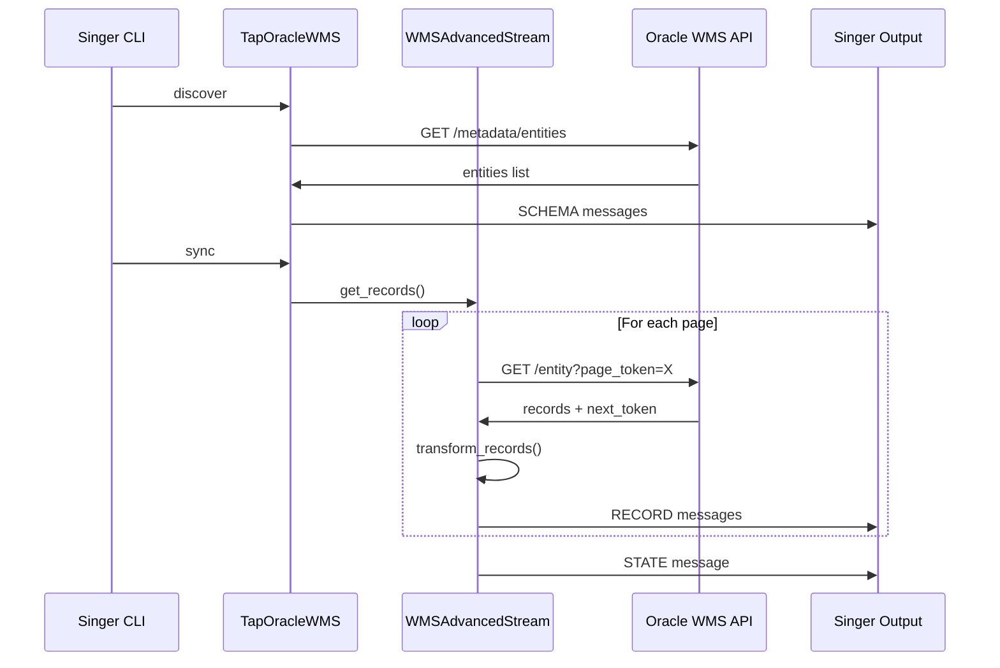

# Oracle WMS Tap Architecture Documentation

**Version**: 0.2.0  
**Singer SDK**: 0.47.4+  
**Type**: Singer TAP (Data Extraction)  
**Source**: Oracle WMS REST API

---

## 📋 Table of Contents

- [Overview](#overview)
- [Architecture Layers](#architecture-layers)
- [Core Components](#core-components)
- [Singer SDK 0.47.4+ Integration](#singer-sdk-0474-integration)
- [Oracle WMS API Integration](#oracle-wms-api-integration)
- [Stream Architecture](#stream-architecture)
- [Data Flow Architecture](#data-flow-architecture)
- [Performance Optimizations](#performance-optimizations)
- [Authentication & Security](#authentication--security)
- [Error Handling & Recovery](#error-handling--recovery)
- [Configuration Architecture](#configuration-architecture)
- [Extension Points](#extension-points)

---

## 🎯 Overview

The Oracle WMS Tap is a production-grade Singer tap implementation that extracts data from Oracle Warehouse Management System REST APIs. Built on the latest Singer SDK 0.47.4+ architecture, it provides enterprise-level features for WMS data extraction and integration.

### Key Architectural Principles

- **Modern Singer Protocol Compliance**: Full adherence to Singer SDK 0.47.4+ interfaces
- **REST API First Design**: Optimized for Oracle WMS REST API patterns
- **WMS Domain Expertise**: Built-in understanding of warehouse management data structures
- **Production Scalability**: Designed for high-volume enterprise data extraction
- **Extensible Architecture**: Modular design for customization and extension

---

## 🏗️ Architecture Layers



### Layer Responsibilities

| Layer          | Component       | Responsibility                              |
| -------------- | --------------- | ------------------------------------------- |
| **Source**     | Oracle WMS API  | WMS data endpoints, authentication          |
| **Transport**  | HTTP/Auth       | Request handling, authentication, retries   |
| **Processing** | Streams         | Data extraction, pagination, transformation |
| **Protocol**   | Tap             | Singer message generation, state management |
| **Output**     | Singer Messages | SCHEMA, RECORD, STATE message emission      |

---

## 🔧 Core Components

### 1. TapOracleWMS (Main Entry Point)

```python
# src/tap_oracle_wms/tap.py
class TapOracleWMS(Tap):
    """Main tap class implementing Singer SDK 0.47.4+ Tap interface"""

    name = "tap-oracle-wms"
    config_jsonschema = config_schema.to_dict()
    default_stream_class = WMSAdvancedStream
```

**Key Features**:

- Singer SDK 0.47.4+ Tap compliance
- WMS-specific configuration validation
- Stream discovery and catalog generation
- State management for incremental sync
- Performance monitoring and metrics

### 2. WMSAdvancedStream (Data Extraction)

```python
# src/tap_oracle_wms/streams.py
class WMSAdvancedStream(RESTStream):
    """Advanced WMS stream with REST API integration"""

    # Modern pagination support
    next_page_token_jsonpath = "$.next"

    # WMS-specific configurations
    records_jsonpath = "$.results[*]"
    replication_method = "INCREMENTAL"
    replication_key = "mod_ts"
```

**Key Features**:

- RESTStream-based architecture for HTTP APIs
- HATEOAS pagination with ParseResult objects
- WMS entity mapping and transformation
- Incremental sync with timestamp-based replication
- Circuit breaker pattern for resilience

### 3. Oracle WMS API Integration

```python
# HTTP client configuration for Oracle WMS
WMS_API_CONFIG = {
    "base_url": "https://wms.company.com/api/v1",
    "authentication": ["basic", "oauth2"],
    "pagination": "cursor",  # HATEOAS links
    "rate_limiting": "adaptive",
}
```

**Key Features**:

- Oracle WMS REST API client integration
- Multiple authentication methods (Basic, OAuth2)
- Adaptive rate limiting and backoff
- Request/response monitoring and logging

---

## 🎵 Singer SDK 0.47.4+ Integration

### Modern Tap Implementation

#### Enhanced Capabilities Declaration

```python
from singer_sdk.helpers.capabilities import TapCapabilities

class TapOracleWMS(Tap):
    """Modern tap with enhanced capabilities"""

    def __init__(self, *args, **kwargs):
        super().__init__(*args, **kwargs)

        # Declare modern Singer capabilities
        self.capabilities = [
            TapCapabilities.DISCOVER,      # Schema discovery
            TapCapabilities.CATALOG,       # Stream catalog management
            TapCapabilities.STATE,         # Incremental sync state
            TapCapabilities.PROPERTIES,    # Configuration properties
        ]
```

#### Modern Stream Discovery

```python
def discover_streams(self) -> list[Stream]:
    """Dynamic stream discovery using WMS API introspection"""

    # Use WMS API metadata endpoints
    wms_entities = self._discover_wms_entities()

    streams = []
    for entity in wms_entities:
        # Generate stream class dynamically
        stream_class = self._create_stream_class(entity)
        streams.append(stream_class(tap=self))

    return streams

def _discover_wms_entities(self) -> list[dict]:
    """Discover available WMS entities from API"""
    response = self._request("GET", "/metadata/entities")
    return response.json()["entities"]
```

#### Configuration Schema with Modern Typing

```python
from singer_sdk import typing as th

config_schema = th.PropertiesList(
    # === WMS API CONNECTION ===
    th.Property(
        "base_url",
        th.StringType,
        required=True,
        description="Oracle WMS API base URL",
        examples=["https://wms.company.com/api/v1"],
        pattern=r"^https?://.*",
    ),

    # === AUTHENTICATION ===
    th.Property(
        "auth_method",
        th.StringType,
        default="basic",
        allowed_values=["basic", "oauth2"],
        description="Authentication method for WMS API",
    ),

    # === PERFORMANCE TUNING ===
    th.Property(
        "page_size",
        th.IntegerType,
        default=1000,
        minimum=10,
        maximum=5000,
        description="Number of records per API page",
    ),

    # === WMS-SPECIFIC SETTINGS ===
    th.Property(
        "wms_entities",
        th.ArrayType(th.StringType),
        description="List of WMS entities to extract",
        examples=[["allocation", "order_hdr", "order_dtl", "item_master"]],
    ),
)
```

---

## 🌐 Oracle WMS API Integration

### REST API Client Architecture

#### HTTP Client Configuration

```python
class WMSAPIClient:
    """Oracle WMS REST API client with enterprise features"""

    def __init__(self, config: dict):
        self.base_url = config["base_url"]
        self.auth_handler = self._create_auth_handler(config)
        self.session = self._create_http_session(config)

    def _create_http_session(self, config: dict) -> requests.Session:
        """Create HTTP session with WMS-specific optimizations"""
        session = requests.Session()

        # Connection pooling for performance
        adapter = HTTPAdapter(
            pool_connections=config.get("max_connections", 10),
            pool_maxsize=config.get("pool_maxsize", 20),
            max_retries=Retry(
                total=config.get("max_retries", 3),
                backoff_factor=config.get("backoff_factor", 1.0),
                status_forcelist=[500, 502, 503, 504],
            )
        )

        session.mount("http://", adapter)
        session.mount("https://", adapter)

        return session
```

#### Authentication Handlers

```python
class WMSBasicAuth(requests.auth.AuthBase):
    """Basic authentication for Oracle WMS"""

    def __init__(self, username: str, password: str):
        self.username = username
        self.password = password

    def __call__(self, r: requests.PreparedRequest) -> requests.PreparedRequest:
        r.headers["Authorization"] = f"Basic {self._encode_credentials()}"
        return r

class WMSOAuth2Handler:
    """OAuth2 authentication for Oracle WMS"""

    def __init__(self, client_id: str, client_secret: str, token_url: str):
        self.client_id = client_id
        self.client_secret = client_secret
        self.token_url = token_url
        self.access_token = None
        self.token_expires_at = None

    def get_access_token(self) -> str:
        """Get valid access token, refreshing if necessary"""
        if self._is_token_expired():
            self._refresh_token()
        return self.access_token
```

### WMS Entity Mapping

#### Entity Configuration

```python
WMS_ENTITIES = {
    "allocation": {
        "endpoint": "/allocations",
        "primary_key": ["facility_id", "location_id", "item_id", "lot_id"],
        "replication_key": "mod_ts",
        "replication_method": "INCREMENTAL",
        "schema_path": "schemas/allocation.json",
    },
    "order_hdr": {
        "endpoint": "/orders/headers",
        "primary_key": ["order_id"],
        "replication_key": "mod_ts",
        "replication_method": "INCREMENTAL",
        "schema_path": "schemas/order_header.json",
    },
    "order_dtl": {
        "endpoint": "/orders/details",
        "primary_key": ["order_id", "line_number"],
        "replication_key": "mod_ts",
        "replication_method": "INCREMENTAL",
        "schema_path": "schemas/order_detail.json",
    },
    "item_master": {
        "endpoint": "/items",
        "primary_key": ["item_id"],
        "replication_key": "mod_ts",
        "replication_method": "INCREMENTAL",
        "schema_path": "schemas/item_master.json",
    },
    "location": {
        "endpoint": "/locations",
        "primary_key": ["location_id"],
        "replication_key": "mod_ts",
        "replication_method": "INCREMENTAL",
        "schema_path": "schemas/location.json",
    },
}
```

---

## 🚰 Stream Architecture

### Modern RESTStream Implementation

```python
class WMSAdvancedStream(RESTStream):
    """Advanced WMS stream with modern Singer SDK patterns"""

    # Singer SDK 0.47.4+ stream configuration
    rest_method = "GET"
    records_jsonpath = "$.results[*]"
    next_page_token_jsonpath = "$.next"

    # WMS-specific configuration
    @property
    def url_base(self) -> str:
        """Base URL for WMS API"""
        return self.config["base_url"]

    @property
    def path(self) -> str:
        """API endpoint path for this WMS entity"""
        return WMS_ENTITIES[self.name]["endpoint"]

    @property
    def primary_keys(self) -> list[str]:
        """Primary key fields for this WMS entity"""
        return WMS_ENTITIES[self.name]["primary_key"]

    @property
    def replication_key(self) -> str:
        """Replication key for incremental sync"""
        return WMS_ENTITIES[self.name]["replication_key"]
```

### Pagination Patterns

#### HATEOAS Pagination (Cursor-based)

```python
def get_next_page_token(
    self,
    response: requests.Response,
    previous_token: Any
) -> Any | None:
    """Extract next page token from HATEOAS links"""

    try:
        data = response.json()

        # Oracle WMS uses HATEOAS links in response
        links = data.get("_links", {})
        next_link = links.get("next", {})
        next_href = next_link.get("href")

        if next_href:
            # Extract page token from URL
            parsed_url = urlparse(next_href)
            params = parse_qs(parsed_url.query)
            return params.get("page_token", [None])[0]

        return None

    except (ValueError, KeyError) as e:
        self.logger.warning(f"Failed to parse next page token: {e}")
        return None

def get_url_params(
    self,
    context: dict | None,
    next_page_token: Any | None
) -> dict[str, Any]:
    """Build URL parameters for WMS API request"""

    params = {
        "page_size": self.config.get("page_size", 1000),
        "order_by": self.replication_key,
    }

    # Add pagination token
    if next_page_token:
        params["page_token"] = next_page_token

    # Add incremental sync filter
    if self.replication_key and self.get_starting_replication_key_value(context):
        start_value = self.get_starting_replication_key_value(context)
        params[f"{self.replication_key}__gte"] = start_value

    # Add WMS-specific filters
    wms_filters = self.config.get("wms_filters", {})
    params.update(wms_filters)

    return params
```

### Record Processing

#### WMS Record Transformation

```python
def post_process(self, row: dict, context: dict | None = None) -> dict | None:
    """Transform WMS record for Singer output"""

    # Apply WMS-specific transformations
    transformed_row = self._transform_wms_record(row)

    # Validate record structure
    if self._should_validate_records():
        validation_result = self._validate_wms_record(transformed_row)
        if not validation_result.is_valid:
            self.logger.warning(f"Invalid WMS record: {validation_result.errors}")
            return None

    # Add extraction metadata
    transformed_row["_sdc_extracted_at"] = datetime.utcnow().isoformat()
    transformed_row["_sdc_batched_at"] = datetime.utcnow().isoformat()

    return transformed_row

def _transform_wms_record(self, record: dict) -> dict:
    """Apply WMS-specific record transformations"""

    # Handle WMS timestamp formats
    for field in ["mod_ts", "created_ts", "updated_ts"]:
        if field in record and record[field]:
            record[field] = self._normalize_wms_timestamp(record[field])

    # Handle WMS composite keys
    if self.name == "allocation":
        record = self._handle_allocation_composite_key(record)

    # Handle WMS hierarchical data
    if self.name == "location":
        record = self._handle_location_hierarchy(record)

    # Convert WMS enums to standard values
    record = self._normalize_wms_enums(record)

    return record
```

---

## 🔄 Data Flow Architecture

### Message Processing Pipeline



### Incremental Sync Flow

1. **State Reading**: Read previous sync state from Singer state file
2. **Bookmark Calculation**: Calculate starting point using replication key
3. **API Request**: Request records newer than bookmark
4. **Record Processing**: Transform and validate WMS records
5. **State Update**: Update bookmark with latest replication key value
6. **Message Emission**: Emit RECORD and STATE messages

### Full Sync Flow

1. **Schema Discovery**: Discover available WMS entities
2. **Stream Initialization**: Initialize streams for selected entities
3. **Complete Extraction**: Extract all records without filters
4. **Record Processing**: Transform and validate all records
5. **Message Emission**: Emit SCHEMA and RECORD messages

---

## ⚡ Performance Optimizations

### WMS API Performance Patterns

#### Adaptive Page Sizing

```python
class AdaptivePageSizer:
    """Dynamically adjust page size based on API performance"""

    def __init__(self, initial_size: int = 1000):
        self.current_size = initial_size
        self.min_size = 100
        self.max_size = 5000
        self.performance_history = []

    def adjust_page_size(self, response_time: float, record_count: int) -> int:
        """Adjust page size based on response performance"""

        throughput = record_count / response_time if response_time > 0 else 0
        self.performance_history.append(throughput)

        # Keep recent history only
        if len(self.performance_history) > 10:
            self.performance_history = self.performance_history[-10:]

        avg_throughput = sum(self.performance_history) / len(self.performance_history)

        # Increase page size if performing well
        if throughput > avg_throughput * 1.2 and self.current_size < self.max_size:
            self.current_size = min(self.max_size, int(self.current_size * 1.1))
        # Decrease if performing poorly
        elif throughput < avg_throughput * 0.8 and self.current_size > self.min_size:
            self.current_size = max(self.min_size, int(self.current_size * 0.9))

        return self.current_size
```

#### Request Caching and Deduplication

```python
class WMSRequestCache:
    """Cache WMS API responses to avoid duplicate requests"""

    def __init__(self, ttl: int = 300):  # 5 minute TTL
        self.cache = {}
        self.ttl = ttl

    def get_cached_response(self, url: str, params: dict) -> dict | None:
        """Get cached response if available and valid"""
        cache_key = self._generate_cache_key(url, params)

        if cache_key in self.cache:
            cached_item = self.cache[cache_key]
            if datetime.utcnow() - cached_item["timestamp"] < timedelta(seconds=self.ttl):
                return cached_item["data"]
            else:
                # Remove expired item
                del self.cache[cache_key]

        return None

    def cache_response(self, url: str, params: dict, data: dict) -> None:
        """Cache API response"""
        cache_key = self._generate_cache_key(url, params)
        self.cache[cache_key] = {
            "data": data,
            "timestamp": datetime.utcnow(),
        }
```

### WMS Entity-Specific Optimizations

#### High-Volume Entity Handling

```python
WMS_PERFORMANCE_CONFIG = {
    "allocation": {
        "page_size": 2000,        # Large page for high-volume data
        "parallel_requests": 3,    # Multiple concurrent requests
        "cache_ttl": 60,          # Short cache TTL for real-time data
    },
    "order_hdr": {
        "page_size": 1500,        # Medium page size
        "parallel_requests": 2,    # Some parallelism
        "cache_ttl": 300,         # Medium cache TTL
    },
    "item_master": {
        "page_size": 500,         # Smaller page for reference data
        "parallel_requests": 1,    # No parallelism for reference data
        "cache_ttl": 3600,        # Long cache TTL for stable data
    },
}
```

---

## 🔒 Authentication & Security

### Multi-Authentication Support

#### Basic Authentication

```python
class WMSBasicAuth:
    """Basic authentication for Oracle WMS APIs"""

    def __init__(self, username: str, password: str):
        self.username = username
        self.password = password

    def apply_auth(self, request: requests.PreparedRequest) -> requests.PreparedRequest:
        """Apply basic auth to request"""
        credentials = f"{self.username}:{self.password}"
        encoded_credentials = base64.b64encode(credentials.encode()).decode()
        request.headers["Authorization"] = f"Basic {encoded_credentials}"
        return request
```

#### OAuth2 with Token Refresh

```python
class WMSOAuth2Handler:
    """OAuth2 handler with automatic token refresh"""

    def __init__(self, client_id: str, client_secret: str, token_url: str):
        self.client_id = client_id
        self.client_secret = client_secret
        self.token_url = token_url
        self.access_token = None
        self.refresh_token = None
        self.token_expires_at = None

    def get_valid_token(self) -> str:
        """Get valid access token, refreshing if necessary"""
        if self._is_token_expired():
            if self.refresh_token:
                self._refresh_access_token()
            else:
                self._obtain_new_token()

        return self.access_token

    def _refresh_access_token(self) -> None:
        """Refresh access token using refresh token"""
        payload = {
            "grant_type": "refresh_token",
            "refresh_token": self.refresh_token,
            "client_id": self.client_id,
            "client_secret": self.client_secret,
        }

        response = requests.post(self.token_url, data=payload)
        response.raise_for_status()

        token_data = response.json()
        self._update_tokens(token_data)
```

### Security Best Practices

#### Credential Management

```python
SECURITY_CONFIG = {
    # Never log sensitive information
    "sensitive_fields": ["password", "client_secret", "access_token"],

    # Use environment variables for credentials
    "credential_sources": ["env_vars", "config_file", "vault"],

    # Encrypt credentials in configuration
    "encrypt_config": True,

    # Use secure connections only
    "enforce_https": True,

    # Token rotation
    "token_rotation_threshold": 0.8,  # Refresh at 80% of expiry
}
```

---

## 🚨 Error Handling & Recovery

### Circuit Breaker Pattern

```python
from enum import Enum
import time

class CircuitState(Enum):
    CLOSED = "closed"
    OPEN = "open"
    HALF_OPEN = "half_open"

class WMSCircuitBreaker:
    """Circuit breaker for WMS API calls"""

    def __init__(
        self,
        failure_threshold: int = 5,
        recovery_timeout: int = 60,
        success_threshold: int = 3
    ):
        self.failure_threshold = failure_threshold
        self.recovery_timeout = recovery_timeout
        self.success_threshold = success_threshold

        self.failure_count = 0
        self.success_count = 0
        self.last_failure_time = None
        self.state = CircuitState.CLOSED

    def call(self, func, *args, **kwargs):
        """Execute function with circuit breaker protection"""

        if self.state == CircuitState.OPEN:
            if self._should_attempt_reset():
                self.state = CircuitState.HALF_OPEN
                self.success_count = 0
            else:
                raise CircuitOpenError("WMS API circuit breaker is OPEN")

        try:
            result = func(*args, **kwargs)
            self._on_success()
            return result

        except Exception as e:
            self._on_failure()
            raise

    def _on_success(self):
        """Handle successful API call"""
        if self.state == CircuitState.HALF_OPEN:
            self.success_count += 1
            if self.success_count >= self.success_threshold:
                self.state = CircuitState.CLOSED
                self.failure_count = 0
        elif self.state == CircuitState.CLOSED:
            self.failure_count = 0

    def _on_failure(self):
        """Handle failed API call"""
        self.failure_count += 1
        self.last_failure_time = time.time()

        if self.failure_count >= self.failure_threshold:
            self.state = CircuitState.OPEN
```

### Retry Mechanisms

#### Exponential Backoff with Jitter

```python
import backoff
import random

class WMSRetryHandler:
    """Advanced retry handling for WMS API calls"""

    @backoff.on_exception(
        backoff.expo,
        (requests.exceptions.RequestException, requests.exceptions.Timeout),
        max_tries=3,
        max_time=300,
        jitter=backoff.random_jitter,
    )
    def make_request_with_retry(self, method: str, url: str, **kwargs) -> requests.Response:
        """Make HTTP request with exponential backoff retry"""

        # Add jitter to prevent thundering herd
        if hasattr(self, '_retry_attempt') and self._retry_attempt > 1:
            jitter_delay = random.uniform(0.1, 1.0)
            time.sleep(jitter_delay)

        response = self.session.request(method, url, **kwargs)

        # Check for rate limiting
        if response.status_code == 429:
            retry_after = int(response.headers.get('Retry-After', 60))
            self.logger.warning(f"Rate limited, waiting {retry_after} seconds")
            time.sleep(retry_after)
            raise requests.exceptions.RequestException("Rate limited")

        response.raise_for_status()
        return response
```

---

## ⚙️ Configuration Architecture

### Hierarchical Configuration System

```python
from singer_sdk import typing as th

# Complete configuration schema for Oracle WMS Tap
config_schema = th.PropertiesList(
    # === WMS API CONNECTION ===
    th.Property(
        "base_url",
        th.StringType,
        required=True,
        description="Oracle WMS API base URL",
        examples=["https://wms.company.com/api/v1"],
    ),

    # === AUTHENTICATION ===
    th.Property(
        "auth_method",
        th.StringType,
        default="basic",
        allowed_values=["basic", "oauth2"],
        description="Authentication method",
    ),
    th.Property(
        "username",
        th.StringType,
        description="Username for basic authentication",
    ),
    th.Property(
        "password",
        th.StringType,
        secret=True,
        description="Password for basic authentication",
    ),
    th.Property(
        "client_id",
        th.StringType,
        description="OAuth2 client ID",
    ),
    th.Property(
        "client_secret",
        th.StringType,
        secret=True,
        description="OAuth2 client secret",
    ),

    # === PERFORMANCE TUNING ===
    th.Property(
        "page_size",
        th.IntegerType,
        default=1000,
        minimum=10,
        maximum=5000,
        description="Records per API page",
    ),
    th.Property(
        "request_timeout",
        th.IntegerType,
        default=300,
        description="HTTP request timeout in seconds",
    ),
    th.Property(
        "max_retries",
        th.IntegerType,
        default=3,
        description="Maximum retry attempts",
    ),

    # === WMS-SPECIFIC CONFIGURATION ===
    th.Property(
        "wms_entities",
        th.ArrayType(th.StringType),
        description="WMS entities to extract",
        examples=[["allocation", "order_hdr", "order_dtl"]],
    ),
    th.Property(
        "wms_filters",
        th.ObjectType(),
        description="Additional WMS API filters",
        examples=[{"facility_id": "DC01", "status": "ACTIVE"}],
    ),

    # === INCREMENTAL SYNC ===
    th.Property(
        "start_date",
        th.DateTimeType,
        description="Start date for incremental sync",
    ),
    th.Property(
        "replication_key_lookback_window",
        th.IntegerType,
        default=300,
        description="Lookback window in seconds for incremental sync",
    ),

    # === MONITORING & DEBUGGING ===
    th.Property(
        "debug_mode",
        th.BooleanType,
        default=False,
        description="Enable debug logging",
    ),
    th.Property(
        "enable_request_logging",
        th.BooleanType,
        default=False,
        description="Log HTTP requests/responses",
    ),
)
```

---

## 🔌 Extension Points

### Custom Stream Implementation

```python
class CustomWMSStream(WMSAdvancedStream):
    """Custom WMS stream with company-specific logic"""

    def post_process(self, row: dict, context: dict | None = None) -> dict | None:
        """Apply company-specific transformations"""

        # Call parent processing
        processed_row = super().post_process(row, context)

        if processed_row:
            # Apply custom business rules
            processed_row = self._apply_company_transformations(processed_row)

        return processed_row

    def _apply_company_transformations(self, record: dict) -> dict:
        """Company-specific record transformations"""
        # Custom transformation logic
        return record
```

### Plugin Architecture

```python
class WMSTransformationPlugin:
    """Plugin interface for custom transformations"""

    def transform_record(self, stream_name: str, record: dict) -> dict:
        """Transform record for specific stream"""
        raise NotImplementedError

    def validate_record(self, stream_name: str, record: dict) -> bool:
        """Validate record for specific stream"""
        raise NotImplementedError

class CompanySpecificPlugin(WMSTransformationPlugin):
    """Company-specific transformation plugin"""

    def transform_record(self, stream_name: str, record: dict) -> dict:
        if stream_name == "allocation":
            return self._transform_allocation(record)
        return record
```

---

## 📊 Monitoring & Observability

### Built-in Metrics

```python
TAP_METRICS = {
    "records_extracted": "Total records extracted from WMS API",
    "api_requests_made": "Total API requests to WMS",
    "api_errors": "Number of API errors encountered",
    "average_response_time": "Average WMS API response time",
    "streams_processed": "Number of streams processed",
    "state_updates": "Number of state bookmark updates",
}
```

### Performance Monitoring

```python
class WMSPerformanceMonitor:
    """Monitor WMS tap performance"""

    def __init__(self):
        self.start_time = datetime.utcnow()
        self.request_times = []
        self.record_counts = []

    def track_api_request(self, response_time: float, record_count: int):
        """Track API request performance"""
        self.request_times.append(response_time)
        self.record_counts.append(record_count)

    def generate_performance_report(self) -> dict:
        """Generate performance summary"""
        total_time = (datetime.utcnow() - self.start_time).total_seconds()
        total_records = sum(self.record_counts)
        avg_response_time = sum(self.request_times) / len(self.request_times)

        return {
            "total_extraction_time": total_time,
            "total_records_extracted": total_records,
            "records_per_second": total_records / total_time,
            "average_api_response_time": avg_response_time,
            "total_api_requests": len(self.request_times),
        }
```

---

## 📝 Summary

The Oracle WMS Tap architecture provides a robust, scalable, and feature-rich solution for extracting data from Oracle Warehouse Management System REST APIs. Built on modern Singer SDK 0.47.4+ foundations, it offers:

- **Enterprise-Grade Performance**: Optimized for high-volume WMS data extraction
- **REST API Native Integration**: Full utilization of Oracle WMS REST API capabilities
- **WMS Domain Expertise**: Built-in understanding of warehouse management data patterns
- **Production Reliability**: Comprehensive error handling, retries, and monitoring
- **Extensible Design**: Multiple extension points for customization

The architecture balances performance, reliability, and maintainability while providing the flexibility needed for diverse enterprise WMS integration scenarios.
