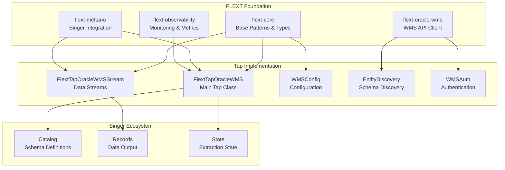

# FLEXT Ecosystem Integration

## Overview

This document describes the integration patterns between FLEXT Tap Oracle WMS and the FLEXT ecosystem components, including flext-core, flext-oracle-wms, flext-meltano, and flext-observability.

## FLEXT Ecosystem Architecture



## Integration Patterns

### 1. flext-core Integration

#### Base Pattern Usage

```python
from flext_core import (
    FlextConfig,          # Configuration base class
    FlextLogger,          # Standardized logging
    TAnyDict,            # Type definitions
    TEntityId,           # Entity identifier type
    ServiceResult,       # Result handling pattern
)

class WMSConfig(FlextConfig):
    """Configuration using flext-core patterns."""

    base_url: str
    auth_method: str
    company_code: str
    facility_code: str
    entities: List[str] = Field(default=["item", "inventory"])

    class Config:
        """Pydantic configuration."""
        env_prefix = "TAP_ORACLE_WMS_"
        case_sensitive = False

class FlextTapOracleWMS:
    """Main tap implementation using flext-core patterns."""

    def __init__(self, config: TAnyDict):
        self.config = WMSConfig(**config)
        self.logger = FlextLogger(__name__)

    def discover_streams(self) -> ServiceResult[List[Stream]]:
        """Return streams using ServiceResult pattern."""
        try:
            streams = self._build_streams()
            return ServiceResult.success(streams)
        except Exception as e:
            self.logger.error(f"Stream discovery failed: {e}")
            return ServiceResult.failure(f"Discovery error: {e}")
```

#### Type System Integration

```python
from flext_core import TAnyDict, TEntityId, TValue

# Use centralized types instead of custom definitions
OracleWmsRecord = TAnyDict        # WMS record data
OracleWmsEntityId = TEntityId     # Entity identifiers
OracleWmsValue = TValue           # Field values

class FlextTapOracleWMSStream:
    """Stream using flext-core type system."""

    def get_records(self, context) -> Iterator[TAnyDict]:
        """Return records using standard types."""
        for record in self.wms_client.get_entity_data(self.name):
            yield self._transform_record(record)

    def _transform_record(self, raw_record: TAnyDict) -> TAnyDict:
        """Transform raw WMS record to standard format."""
        return {
            "id": TEntityId(raw_record.get("id")),
            "data": raw_record,
            "extracted_at": datetime.utcnow().isoformat()
        }
```

#### Logging Integration

```python
from flext_core import FlextLogger
import logging

class FlextTapOracleWMSStream:
    """Stream with standardized logging."""

    def __init__(self, tap, name: str):
        self.tap = tap
        self.name = name
        self.logger = FlextLogger(f"{__name__}.{name}")

    def get_records(self, context):
        """Extract records with comprehensive logging."""
        self.logger.info(f"Starting extraction for entity: {self.name}")

        try:
            record_count = 0
            for record in self.wms_client.get_entity_data(self.name):
                record_count += 1
                if record_count % 1000 == 0:
                    self.logger.info(f"Extracted {record_count} records from {self.name}")
                yield record

            self.logger.info(f"Completed extraction: {record_count} records from {self.name}")

        except Exception as e:
            self.logger.error(f"Extraction failed for {self.name}: {e}", exc_info=True)
            raise
```

### 2. flext-oracle-wms Integration

#### WMS Client Integration

```python
from flext_oracle_wms import (
    FlextOracleWmsClient,
    FlextOracleWmsError,
    FlextOracleWmsAuthenticationError,
    WMSEntityMetadata,
)

class WMSClientManager:
    """Manage WMS client using flext-oracle-wms library."""

    def __init__(self, config: WMSConfig):
        self.config = config
        self._client = None
        self.logger = FlextLogger(__name__)

    @property
    def client(self) -> FlextOracleWmsClient:
        """Get configured WMS client."""
        if not self._client:
            self._client = FlextOracleWmsClient(
                base_url=self.config.base_url,
                auth_method=self.config.auth_method,
                username=self.config.username,
                password=self.config.password,
                company_code=self.config.company_code,
                facility_code=self.config.facility_code,
            )
        return self._client

    def test_connection(self) -> ServiceResult[bool]:
        """Test WMS connection using library client."""
        try:
            result = self.client.test_connection()
            if result:
                self.logger.info("WMS connection successful")
                return ServiceResult.success(True)
            else:
                return ServiceResult.failure("WMS connection test failed")
        except FlextOracleWmsAuthenticationError as e:
            self.logger.error(f"WMS authentication failed: {e}")
            return ServiceResult.failure(f"Authentication error: {e}")
        except FlextOracleWmsError as e:
            self.logger.error(f"WMS client error: {e}")
            return ServiceResult.failure(f"WMS error: {e}")
```

#### Entity Discovery Integration

```python
from flext_oracle_wms import WMSEntityMetadata
from typing import List, Dict, object

class EntityDiscovery:
    """Entity discovery using flext-oracle-wms."""

    def __init__(self, wms_client: FlextOracleWmsClient):
        self.wms_client = wms_client
        self.logger = FlextLogger(__name__)

    def discover_entities(self) -> ServiceResult[List[str]]:
        """Discover available entities using WMS client."""
        try:
            entities = self.wms_client.get_available_entities()
            self.logger.info(f"Discovered {len(entities)} WMS entities")
            return ServiceResult.success(entities)
        except Exception as e:
            self.logger.error(f"Entity discovery failed: {e}")
            return ServiceResult.failure(f"Discovery error: {e}")

    def get_entity_metadata(self, entity: str) -> ServiceResult[WMSEntityMetadata]:
        """Get entity metadata using library client."""
        try:
            metadata = self.wms_client.get_entity_metadata(entity)
            return ServiceResult.success(metadata)
        except Exception as e:
            self.logger.error(f"Metadata retrieval failed for {entity}: {e}")
            return ServiceResult.failure(f"Metadata error: {e}")

    def generate_schema(self, entity: str) -> ServiceResult[Dict[str, object]]:
        """Generate Singer schema from WMS metadata."""
        metadata_result = self.get_entity_metadata(entity)
        if not metadata_result.success:
            return ServiceResult.failure(metadata_result.error)

        try:
            schema = self._convert_metadata_to_schema(metadata_result.data)
            return ServiceResult.success(schema)
        except Exception as e:
            return ServiceResult.failure(f"Schema generation error: {e}")
```

### 3. flext-meltano Integration

#### Singer SDK Integration

```python
from flext_meltano import (
    Tap,                    # Base tap class with FLEXT patterns
    Stream,                 # Base stream class
    singer_typing as th,    # Type definitions
)

class FlextTapOracleWMS(Tap):
    """Tap implementation using flext-meltano patterns."""

    name = "tap-oracle-wms"
    config_jsonschema = WMSConfig.schema()

    def __init__(self, config: dict):
        super().__init__(config)
        self.wms_client_manager = WMSClientManager(self.config)

    def discover_streams(self) -> List[Stream]:
        """Discover streams using flext-meltano patterns."""
        discovery = EntityDiscovery(self.wms_client_manager.client)
        entities_result = discovery.discover_entities()

        if not entities_result.success:
            raise RuntimeError(f"Stream discovery failed: {entities_result.error}")

        return [
            FlextTapOracleWMSStream(tap=self, name=entity)
            for entity in entities_result.data
            if entity in self.config.entities
        ]

class FlextTapOracleWMSStream(Stream):
    """WMS stream using flext-meltano base class."""

    def __init__(self, tap: FlextTapOracleWMS, name: str):
        super().__init__(tap)
        self.name = name
        self.tap = tap

    @property
    def schema(self) -> Dict[str, object]:
        """Get stream schema from WMS metadata."""
        discovery = EntityDiscovery(self.tap.wms_client_manager.client)
        schema_result = discovery.generate_schema(self.name)

        if not schema_result.success:
            raise RuntimeError(f"Schema generation failed: {schema_result.error}")

        return schema_result.data

    def get_records(self, context) -> Iterator[Dict[str, object]]:
        """Extract records using WMS client."""
        try:
            for record in self.tap.wms_client_manager.client.get_entity_data(self.name):
                yield record
        except Exception as e:
            self.logger.error(f"Record extraction failed: {e}")
            raise
```

#### Configuration Integration

```python
from flext_meltano import MeltanoConfig
from pydantic import Field, validator

class WMSMeltanoConfig(MeltanoConfig):
    """Meltano-specific configuration with FLEXT patterns."""

    # Connection settings
    base_url: str = Field(..., description="Oracle WMS instance URL")
    auth_method: str = Field(..., regex="^(basic|oauth2)$", description="Authentication method")
    company_code: str = Field(..., description="WMS company code")
    facility_code: str = Field(..., description="WMS facility code")

    # Authentication settings
    username: Optional[str] = Field(None, description="Username for basic auth")
    password: Optional[str] = Field(None, description="Password for basic auth")
    oauth_client_id: Optional[str] = Field(None, description="OAuth2 client ID")
    oauth_client_secret: Optional[str] = Field(None, description="OAuth2 client secret")

    # Extraction settings
    entities: List[str] = Field(
        default=["item", "inventory"],
        description="List of WMS entities to extract"
    )
    page_size: int = Field(
        default=1000,
        le=1250,
        description="Records per page (max 1250)"
    )
    start_date: Optional[datetime] = Field(
        None,
        description="Start date for incremental extraction"
    )

    @validator("entities")
    def validate_entities(cls, v):
        """Validate entity names against available entities."""
        valid_entities = [
            "item", "location", "inventory", "order", "shipment",
            "receipt", "pick", "replenishment", "cycle_count"
        ]
        invalid = set(v) - set(valid_entities)
        if invalid:
            raise ValueError(f"Invalid entities: {invalid}")
        return v
```

### 4. flext-observability Integration

#### Monitoring Integration

```python
from flext_observability import (
    FlextMetrics,
    FlextHealthCheck,
    FlextTracing,
)

class FlextTapOracleWMS(Tap):
    """Tap with comprehensive observability."""

    def __init__(self, config: dict):
        super().__init__(config)
        self.metrics = FlextMetrics(service_name="tap-oracle-wms")
        self.health_check = FlextHealthCheck()
        self.tracing = FlextTracing()

    def discover_streams(self) -> List[Stream]:
        """Stream discovery with metrics and tracing."""
        with self.tracing.span("discover_streams"):
            start_time = time.time()

            try:
                streams = super().discover_streams()

                # Record metrics
                self.metrics.record_counter(
                    "streams_discovered",
                    len(streams),
                    tags={"tap": "oracle-wms"}
                )

                discovery_time = time.time() - start_time
                self.metrics.record_histogram(
                    "discovery_duration_seconds",
                    discovery_time,
                    tags={"tap": "oracle-wms"}
                )

                return streams

            except Exception as e:
                self.metrics.record_counter(
                    "discovery_errors",
                    1,
                    tags={"tap": "oracle-wms", "error": str(e)}
                )
                raise

class FlextTapOracleWMSStream(Stream):
    """Stream with observability integration."""

    def get_records(self, context) -> Iterator[Dict[str, object]]:
        """Record extraction with comprehensive monitoring."""
        with self.tap.tracing.span(f"extract_{self.name}"):
            start_time = time.time()
            record_count = 0

            try:
                for record in self._extract_records():
                    record_count += 1
                    yield record

                    # Record periodic metrics
                    if record_count % 1000 == 0:
                        self.tap.metrics.record_gauge(
                            "records_extracted",
                            record_count,
                            tags={"entity": self.name}
                        )

                # Final metrics
                extraction_time = time.time() - start_time
                self.tap.metrics.record_histogram(
                    "extraction_duration_seconds",
                    extraction_time,
                    tags={"entity": self.name}
                )

                self.tap.metrics.record_counter(
                    "records_total",
                    record_count,
                    tags={"entity": self.name}
                )

            except Exception as e:
                self.tap.metrics.record_counter(
                    "extraction_errors",
                    1,
                    tags={"entity": self.name, "error": str(e)}
                )
                raise
```

#### Health Check Integration

```python
from flext_observability import HealthCheckResult, HealthStatus

class WMSHealthCheck:
    """Health check implementation for WMS tap."""

    def __init__(self, wms_client_manager: WMSClientManager):
        self.wms_client_manager = wms_client_manager
        self.health_check = FlextHealthCheck()

    def register_checks(self):
        """Register health check endpoints."""
        self.health_check.add_check("wms_connection", self._check_wms_connection)
        self.health_check.add_check("wms_authentication", self._check_wms_auth)
        self.health_check.add_check("entity_discovery", self._check_entity_discovery)

    def _check_wms_connection(self) -> HealthCheckResult:
        """Check WMS connection health."""
        try:
            result = self.wms_client_manager.test_connection()
            if result.success:
                return HealthCheckResult(
                    status=HealthStatus.HEALTHY,
                    message="WMS connection successful"
                )
            else:
                return HealthCheckResult(
                    status=HealthStatus.UNHEALTHY,
                    message=f"WMS connection failed: {result.error}"
                )
        except Exception as e:
            return HealthCheckResult(
                status=HealthStatus.UNHEALTHY,
                message=f"WMS connection error: {e}"
            )

    def _check_wms_auth(self) -> HealthCheckResult:
        """Check WMS authentication."""
        try:
            client = self.wms_client_manager.client
            # Test authentication by making a simple API call
            entities = client.get_available_entities()
            return HealthCheckResult(
                status=HealthStatus.HEALTHY,
                message=f"Authentication successful, {len(entities)} entities available"
            )
        except FlextOracleWmsAuthenticationError as e:
            return HealthCheckResult(
                status=HealthStatus.UNHEALTHY,
                message=f"Authentication failed: {e}"
            )
        except Exception as e:
            return HealthCheckResult(
                status=HealthStatus.DEGRADED,
                message=f"Authentication check error: {e}"
            )
```

## Integration Benefits

### Consistency

- **Unified Patterns**: All FLEXT components use consistent patterns
- **Type Safety**: Shared type system across ecosystem
- **Configuration**: Standardized configuration management
- **Logging**: Centralized logging with correlation IDs

### Maintainability

- **Reduced Duplication**: Leverage shared functionality
- **Single Source of Truth**: Configuration and business logic centralized
- **Version Compatibility**: Ecosystem-wide compatibility management
- **Testing**: Shared testing utilities and patterns

### Observability

- **Comprehensive Monitoring**: Built-in metrics and tracing
- **Health Checks**: Standardized health check endpoints
- **Error Tracking**: Centralized error handling and reporting
- **Performance Monitoring**: Real-time performance metrics

### Scalability

- **Performance Optimization**: Shared optimization patterns
- **Resource Management**: Efficient resource utilization
- **Connection Pooling**: Shared connection management
- **Caching**: Coordinated caching strategies

## Migration Considerations

### Current Integration Issues

1. **Inconsistent Patterns**: Mix of custom and FLEXT patterns
2. **Duplicate Functionality**: Reimplemented features available in libraries
3. **Configuration Chaos**: Multiple configuration systems
4. **Limited Observability**: Basic logging without metrics

### Migration Strategy

1. **Phase 1**: Replace custom implementations with FLEXT libraries
2. **Phase 2**: Standardize configuration and error handling
3. **Phase 3**: Add comprehensive observability
4. **Phase 4**: Optimize performance and resource usage

### Validation Steps

1. **Functional Testing**: Ensure all functionality works with FLEXT integration
2. **Performance Testing**: Validate performance improvements
3. **Integration Testing**: Test with other FLEXT ecosystem components
4. **Observability Testing**: Verify metrics and monitoring work correctly

---

**Updated**: 2025-08-13 | **Status**: Integration Documented | **Next**: Implementation Planning
