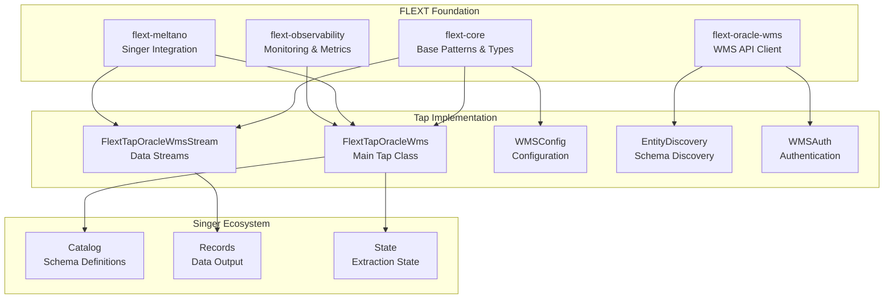

# FLEXT Ecosystem Integration

<!-- TOC START -->

- [Overview](#overview)
- [FLEXT Ecosystem Architecture](#flext-ecosystem-architecture)
- [Integration Patterns](#integration-patterns)
  - [1. flext-core Integration](#1-flext-core-integration)
  - [2. flext-oracle-wms Integration](#2-flext-oracle-wms-integration)
  - [3. flext-meltano Integration](#3-flext-meltano-integration)
  - [4. flext-observability Integration](#4-flext-observability-integration)
- [Integration Benefits](#integration-benefits)
  - [Consistency](#consistency)
  - [Maintainability](#maintainability)
  - [Observability](#observability)
  - [Scalability](#scalability)
- [Migration Considerations](#migration-considerations)
  - [Current Integration Issues](#current-integration-issues)
  - [Migration Strategy](#migration-strategy)
  - [Validation Steps](#validation-steps)
  <!-- TOC END -->

## Overview

This document describes the integration patterns between FLEXT Tap Oracle WMS and the
FLEXT ecosystem components, including flext-core, flext-oracle-wms, flext-meltano, and
flext-observability.

## FLEXT Ecosystem Architecture


```mermaid
graph TB
    subgraph "FLEXT Foundation"
        FC[flext-core<br/>Base Patterns & Types]
        FOW[flext-oracle-wms<br/>WMS API Client]
        FM[flext-meltano<br/>Singer Integration]
        FO[flext-observability<br/>Monitoring & Metrics]
    end

    subgraph "Tap Implementation"
        TAP[FlextTapOracleWms<br/>Main Tap Class]
        STREAMS[FlextTapOracleWmsStream<br/>Data Streams]
        CONFIG[WMSConfig<br/>Configuration]
        DISCOVERY[EntityDiscovery<br/>Schema Discovery]
        AUTH[WMSAuth<br/>Authentication]
    end

    subgraph "Singer Ecosystem"
        CATALOG[Catalog<br/>Schema Definitions]
        RECORDS[Records<br/>Data Output]
        STATE[State<br/>Extraction State]
    end

    FC --> TAP
    FC --> CONFIG
    FC --> STREAMS
    FOW --> AUTH
    FOW --> DISCOVERY
    FM --> TAP
    FM --> STREAMS
    FO --> TAP

    TAP --> CATALOG
    STREAMS --> RECORDS
    TAP --> STATE
```

## Integration Patterns

### 1. flext-core Integration

#### Base Pattern Usage

```python
from __future__ import annotations

from collections.abc import Iterator

from flext_core import (
    FlextSettings,  # Configuration base class
    TAnyDict,
    p,  # Result type
    r,  # Result handling pattern
    t,
)
from flext_cli import u  # utilities
from pydantic import Field
from singer_sdk import Stream


class WMSConfig(FlextSettings):
    """Configuration using flext-core patterns."""

    base_url: str
    auth_method: str
    company_code: str
    facility_code: str
    entities: t.StringList = Field(default=["item", "inventory"])

    class Config:
        """Pydantic configuration."""

        env_prefix = "TAP_ORACLE_WMS_"
        case_sensitive = False


class FlextTapOracleWms:
    """Main tap implementation using flext-core patterns."""

    def __init__(self, settings: TAnyDict):
        """Initialize tap with WMS settings."""
        self.settings = WMSConfig(**settings)
        self.logger = u.fetch_logger(__name__)

    def discover_streams(self) -> p.Result[list[Stream]]:
        """Return streams using r pattern."""
        try:
            streams = self._build_streams()
            return r.success(streams)
        except Exception as exc:
            self.logger.exception("Stream discovery failed: %s", exc)
            return r.failure(f"Discovery error: {exc}")
```
#### Type System Integration

```python
from __future__ import annotations

from collections.abc import Iterator

from flext_core import TAnyDict, TEntityId, TValue, p, r
from datetime import datetime


# Use centralized types instead of custom definitions
OracleWmsRecord = TAnyDict  # WMS record data
OracleWmsEntityId = TEntityId  # Entity identifiers
OracleWmsValue = TValue  # Field values


class FlextTapOracleWmsStream:
    """Stream using flext-core type system."""

    def get_records(self, context) -> Iterator[TAnyDict]:
        """Return records using standard types."""
        for record in self.wms_client.get_entity_data(self.name):
            yield self._transform_record(record)

    def _transform_record(self, raw_record: TAnyDict) -> TAnyDict:
        """Transform raw WMS record to standard format."""
        return {
            "id": TEntityId(raw_record.get("id")),
            "data": raw_record,
            "extracted_at": datetime.utcnow().isoformat(),
        }
```
#### Logging Integration

```python
from __future__ import annotations

from flext_cli import u


class FlextTapOracleWmsStream:
    """Stream with standardized logging."""

    def __init__(self, tap, name: str):
        """Initialize stream with tap and name."""
        self.tap = tap
        self.name = name
        self.logger = u.fetch_logger(f"{__name__}.{name}")

    def get_records(self, context):
        """Extract records with comprehensive logging."""
        self.logger.info(f"Starting extraction for entity: {self.name}")

        try:
            record_count = 0
            for record in self.wms_client.get_entity_data(self.name):
                record_count += 1
                if record_count % 1000 == 0:
                    self.logger.info(
                        f"Extracted {record_count} records from {self.name}"
                    )
                yield record

            self.logger.info(
                f"Completed extraction: {record_count} records from {self.name}"
            )

        except Exception as exc:
            self.logger.exception("Extraction failed for %s: %s", self.name, exc)
            raise
```
### 2. flext-oracle-wms Integration

#### WMS Client Integration

```python
from __future__ import annotations

from flext_core import t, p, r, m
from flext_oracle_wms import (
    FlextOracleWmsAuthenticationError,
    FlextOracleWmsClient,
    FlextOracleWmsError,
)
from pydantic import Field


class WMSClientManager:
    """Manage WMS client using flext-oracle-wms library."""

    def __init__(self, settings: dict):
        """Initialize WMS client manager."""
        self.settings = settings
        self._client = None
        self.logger = u.fetch_logger(__name__)

    @property
    def client(self) -> FlextOracleWmsClient:
        """Configured WMS client."""
        if not self._client:
            self._client = FlextOracleWmsClient(
                base_url=self.settings.base_url,
                auth_method=self.settings.auth_method,
                username=self.settings.username,
                password=self.settings.password,
                company_code=self.settings.company_code,
                facility_code=self.settings.facility_code,
            )
        return self._client

    def test_connection(self) -> p.Result[bool]:
        """Test WMS connection using library client."""
        try:
            result = self.client.test_connection()
            if result:
                self.logger.info("WMS connection successful")
                return r.success(True)
            return r.failure("WMS connection test failed")
        except FlextOracleWmsAuthenticationError as exc:
            self.logger.exception("WMS authentication failed: %s", exc)
            return r.failure(f"Authentication error: {exc}")
        except FlextOracleWmsError as exc:
            self.logger.exception("WMS client error: %s", exc)
            return r.failure(f"WMS error: {exc}")
```
#### Entity Discovery Integration

```python
from __future__ import annotations

from flext_core import t, p, r
from flext_oracle_wms import FlextOracleWmsClient, WMSEntityMetadata


class EntityDiscovery:
    """Entity discovery using flext-oracle-wms."""

    def __init__(self, wms_client: FlextOracleWmsClient):
        """Initialize entity discovery with WMS client."""
        self.wms_client = wms_client
        self.logger = u.fetch_logger(__name__)

    def discover_entities(self) -> p.Result[t.StringList]:
        """Discover available entities using WMS client."""
        try:
            entities = self.wms_client.get_available_entities()
            self.logger.info(f"Discovered {len(entities)} WMS entities")
            return r.success(entities)
        except Exception as exc:
            self.logger.exception("Entity discovery failed: %s", exc)
            return r.failure(f"Discovery error: {exc}")

    def get_entity_metadata(self, entity: str) -> p.Result[WMSEntityMetadata]:
        """Get entity metadata using library client."""
        try:
            metadata = self.wms_client.get_entity_metadata(entity)
            return r.success(metadata)
        except Exception as exc:
            self.logger.exception("Metadata retrieval failed for %s: %s", entity, exc)
            return r.failure(f"Metadata error: {exc}")

    def generate_schema(self, entity: str) -> p.Result[t.Dict]:
        """Generate Singer schema from WMS metadata."""
        metadata_result = self.get_entity_metadata(entity)
        if metadata_result.failure:
            return r.failure(metadata_result.error)

        try:
            schema = self._convert_metadata_to_schema(metadata_result.value)
            return r.success(schema)
        except Exception as exc:
            return r.failure(f"Schema generation error: {exc}")
```
### 3. flext-meltano Integration

#### Singer SDK Integration

```python
from __future__ import annotations

from collections.abc import Iterator

from flext_meltano import Stream, Tap
from flext_core import p, r, t, m
from pydantic import Field
from datetime import datetime


class FlextTapOracleWms(Tap):
    """Tap implementation using flext-meltano patterns."""

    name = "tap-oracle-wms"
    config_jsonschema = WMSConfig.schema()

    def __init__(self, settings: dict):
        """Initialize tap with settings."""
        super().__init__(settings)
        self.wms_client_manager = WMSClientManager(self.settings)
        self.logger = u.fetch_logger(__name__)

    def discover_streams(self) -> list[Stream]:
        """Discover streams using flext-meltano patterns."""
        discovery = EntityDiscovery(self.wms_client_manager.client)
        entities_result = discovery.discover_entities()

        if entities_result.failure:
            discovery_error = entities_result.error
            raise RuntimeError(discovery_error)

        return [
            FlextTapOracleWmsStream(tap=self, name=entity)
            for entity in entities_result.value
            if entity in self.settings.entities
        ]


class FlextTapOracleWmsStream(Stream):
    """WMS stream using flext-meltano base class."""

    def __init__(self, tap: FlextTapOracleWms, name: str):
        """Initialize WMS stream."""
        super().__init__(tap)
        self.name = name
        self.tap = tap
        self.logger = u.fetch_logger(__name__)

    @property
    def schema(self) -> m.Dict:
        """Stream schema from WMS metadata."""
        discovery = EntityDiscovery(self.tap.wms_client_manager.client)
        schema_result = discovery.generate_schema(self.name)

        if schema_result.failure:
            schema_error = schema_result.error
            raise RuntimeError(schema_error)

        return schema_result.value

    def get_records(self, context) -> Iterator[m.Dict]:
        """Extract records using WMS client."""
        try:
            for record in self.tap.wms_client_manager.client.get_entity_data(self.name):
                yield record
        except Exception as exc:
            self.logger.exception("Record extraction failed: %s", exc)
            raise
```
#### Configuration Integration

The current settings owner is `FlextTapOracleWmsSettings`, with fields under
`TapOracleWms`. Connection credentials, entity inclusion/exclusion, pagination,
and incremental dates are validated there. Do not recreate the removed
`MeltanoConfig` contract or duplicate its former entity catalog and defaults.

The public `from_settings` boundary lowers the typed settings and catalog to
Singer's constructor format. Supplying a catalog avoids live discovery during
construction:

```python
from __future__ import annotations

from flext_tap_oracle_wms import FlextTapOracleWmsSettings, m
from flext_tap_oracle_wms.tap import FlextTapOracleWms


def configured_tap(
    configuration: FlextTapOracleWmsSettings, catalog: m.Meltano.SingerCatalog
) -> FlextTapOracleWms:
    """Construct a tap through its typed public boundary."""
    return FlextTapOracleWms.from_settings(configuration, catalog=catalog)
```

### 4. flext-observability Integration

#### Monitoring Integration

```python
from __future__ import annotations

from collections.abc import Iterator

from flext_observability import FlextHealthCheck, FlextMetrics, FlextTracing
from flext_meltano import Tap
from singer_sdk import Stream
import time
from flext_core import m, u


class FlextTapOracleWms(Tap):
    """Tap with comprehensive observability."""

    def __init__(self, settings: dict):
        """Initialize tap with observability."""
        super().__init__(settings)
        self.metrics = FlextMetrics(service_name="tap-oracle-wms")
        self.health_check = FlextHealthCheck()
        self.tracing = FlextTracing()
        self.logger = u.fetch_logger(__name__)

    def discover_streams(self) -> list[Stream]:
        """Stream discovery with metrics and tracing."""
        with self.tracing.span("discover_streams"):
            start_time = time.time()

            try:
                streams = super().discover_streams()

                # Record metrics
                self.metrics.record_counter(
                    "streams_discovered", len(streams), tags={"tap": "oracle-wms"}
                )

                discovery_time = time.time() - start_time
                self.metrics.record_histogram(
                    "discovery_duration_seconds",
                    discovery_time,
                    tags={"tap": "oracle-wms"},
                )

                return streams

            except Exception as exc:
                self.metrics.record_counter(
                    "discovery_errors", 1, tags={"tap": "oracle-wms", "error": str(exc)}
                )
                raise


class FlextTapOracleWmsStream(Stream):
    """Stream with observability integration."""

    def get_records(self, context) -> Iterator[m.Dict]:
        """Record extraction with comprehensive monitoring."""
        with self.tap.tracing.span(f"extract_{self.name}"):
            start_time = time.time()
            record_count = 0

            try:
                for record in self._extract_records():
                    record_count += 1
                    yield record

                    # Record periodic metrics
                    if record_count % 1000 == 0:
                        self.tap.metrics.record_gauge(
                            "records_extracted",
                            record_count,
                            tags={"entity": self.name},
                        )

                # Final metrics
                extraction_time = time.time() - start_time
                self.tap.metrics.record_histogram(
                    "extraction_duration_seconds",
                    extraction_time,
                    tags={"entity": self.name},
                )

                self.tap.metrics.record_counter(
                    "records_total", record_count, tags={"entity": self.name}
                )

            except Exception as exc:
                self.tap.metrics.record_counter(
                    "extraction_errors",
                    1,
                    tags={"entity": self.name, "error": str(exc)},
                )
                raise
```
#### Health Check Integration

```python
from __future__ import annotations

from flext_oracle_wms import FlextOracleWmsClient
from flext_core import p, r, u
from flext_observability import HealthCheckResult, HealthStatus
from flext_oracle_wms import FlextOracleWmsAuthenticationError


class WMSHealthCheck:
    """Health check implementation for WMS tap."""

    def __init__(self, wms_client_manager: WMSClientManager):
        """Initialize health check with client manager."""
        self.wms_client_manager = wms_client_manager
        self.health_check = FlextHealthCheck()

    def register_checks(self):
        """Register health check endpoints."""
        self.health_check.add_check("wms_connection", self._check_wms_connection)
        self.health_check.add_check("wms_authentication", self._check_wms_auth)
        self.health_check.add_check("entity_discovery", self._check_entity_discovery)

    def _check_wms_connection(self) -> HealthCheckResult:
        """Check WMS connection health."""
        try:
            result = self.wms_client_manager.test_connection()
            if result.success:
                return HealthCheckResult(
                    status=HealthStatus.HEALTHY, message="WMS connection successful"
                )
            return HealthCheckResult(
                status=HealthStatus.UNHEALTHY,
                message=f"WMS connection failed: {result.error}",
            )
        except Exception as exc:
            return HealthCheckResult(
                status=HealthStatus.UNHEALTHY, message=f"WMS connection error: {exc}"
            )

    def _check_wms_auth(self) -> HealthCheckResult:
        """Check WMS authentication."""
        try:
            client = self.wms_client_manager.client
            # Test authentication by making a simple API call
            entities = client.get_available_entities()
            return HealthCheckResult(
                status=HealthStatus.HEALTHY,
                message=f"Authentication successful, {len(entities)} entities available",
            )
        except FlextOracleWmsAuthenticationError as exc:
            return HealthCheckResult(
                status=HealthStatus.UNHEALTHY, message=f"Authentication failed: {exc}"
            )
        except Exception as exc:
            return HealthCheckResult(
                status=HealthStatus.DEGRADED,
                message=f"Authentication check error: {exc}",
            )
```
## Integration Benefits

### Consistency

- **Unified Patterns**: All FLEXT components use consistent patterns
- **Type Safety**: Shared type system across ecosystem
- **Configuration**: Standardized configuration management
- **Logging**: Centralized logging with correlation IDs

### Maintainability

- **Reduced Duplication**: Leverage shared functionality
- **Single Source of Truth**: Configuration and business logic centralized
- **Version Compatibility**: Ecosystem-wide compatibility management
- **Testing**: Shared testing utilities and patterns

### Observability

- **Comprehensive Monitoring**: Built-in metrics and tracing
- **Health Checks**: Standardized health check endpoints
- **Error Tracking**: Centralized error handling and reporting
- **Performance Monitoring**: Real-time performance metrics

### Scalability

- **Performance Optimization**: Shared optimization patterns
- **Resource Management**: Efficient resource utilization
- **Connection Pooling**: Shared connection management
- **Caching**: Coordinated caching strategies

## Migration Considerations

### Current Integration Issues

1. **Inconsistent Patterns**: Mix of custom and FLEXT patterns
1. **Duplicate Functionality**: Reimplemented features available in libraries
1. **Configuration Chaos**: Multiple configuration systems
1. **Limited Observability**: Basic logging without metrics

### Migration Strategy

1. **Phase 1**: Replace custom implementations with FLEXT libraries
1. **Phase 2**: Standardize configuration and error handling
1. **Phase 3**: Add comprehensive observability
1. **Phase 4**: Optimize performance and resource usage

### Validation Steps

1. **Functional Testing**: Ensure all functionality works with FLEXT integration
1. **Performance Testing**: Validate performance improvements
1. **Integration Testing**: Test with other FLEXT ecosystem components
1. **Observability Testing**: Verify metrics and monitoring work correctly

---

**Updated**: 2025-08-13 | **Status**: Integration Documented · 1.0.0 Current | **Next**:
Implementation Planning
