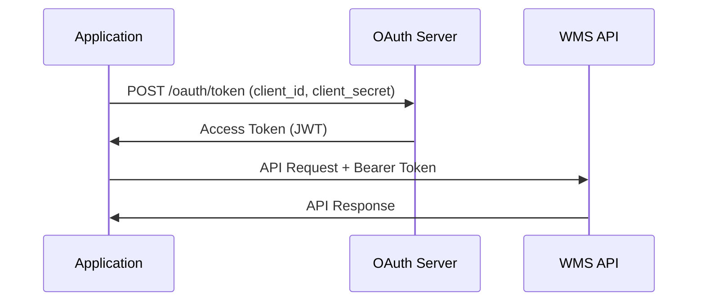

# Oracle WMS Authentication Guide

## Overview

Oracle WMS Cloud supports two primary authentication methods for REST API access:

1. **Basic Authentication** - Simple username/password authentication
2. **OAuth 2.0** - Token-based authentication with enhanced security

Both methods require additional WMS-specific headers for proper context.

## Required Headers

All API requests must include these headers regardless of authentication method:

```http
X-WMS-Company: {company_code}
X-WMS-Facility: {facility_code}
Content-Type: application/json
Accept: application/json
```

## Basic Authentication

### Overview

Basic Authentication is the simplest method, suitable for:

- Development and testing environments
- Internal integrations
- Scripts and automation tools
- Proof of concepts

### Implementation

#### Header Format

```http
Authorization: Basic {base64_encoded_credentials}
```

The credentials are formatted as `username:password` and Base64 encoded.

#### Python Example

```python
import base64
from typing import Dict

def get_basic_auth_header(username: str, password: str) -> Dict[str, str]:
    """Generate Basic Authentication header."""
    credentials = f"{username}:{password}"
    encoded = base64.b64encode(credentials.encode()).decode()
    return {"Authorization": f"Basic {encoded}"}

# Usage
headers = {
    **get_basic_auth_header("wms_user", "secure_password"),
    "X-WMS-Company": "ACME",
    "X-WMS-Facility": "DC01",
    "Content-Type": "application/json",
    "Accept": "application/json"
}
```

#### Configuration Example

```json
{
  "auth_method": "basic",
  "username": "wms_integration_user",
  "password": "${WMS_PASSWORD}",
  "company_code": "ACME",
  "facility_code": "DC01"
}
```

### Security Considerations

- Always use HTTPS to prevent credential exposure
- Store passwords securely (environment variables, secret management)
- Rotate passwords regularly
- Use service accounts, not personal credentials
- Implement IP whitelisting when possible

## OAuth 2.0 Authentication

### Overview

OAuth 2.0 is the recommended authentication method for production, providing:

- Token-based access without exposing passwords
- Fine-grained permissions through scopes
- Token expiration and refresh mechanisms
- Better audit trails

### OAuth Flow

Oracle WMS uses the **Client Credentials Grant** flow:



### Implementation

#### 1. Register OAuth Client

First, register your application in Oracle Identity Cloud Service (IDCS):

```bash
# Request from WMS administrator:
# - Client ID
# - Client Secret
# - Token URL
# - Allowed scopes
```

#### 2. Get Access Token

```python
import httpx
from typing import Dict, Optional
from datetime import datetime, timedelta

class WMSOAuth2Client:
    def __init__(self, client_id: str, client_secret: str, token_url: str):
        self.client_id = client_id
        self.client_secret = client_secret
        self.token_url = token_url
        self._token = None
        self._token_expires = None

    async def get_access_token(self) -> str:
        """Get valid access token, refreshing if needed."""
        if self._token and self._token_expires > datetime.now():
            return self._token

        # Request new token
        async with httpx.AsyncClient() as client:
            response = await client.post(
                self.token_url,
                data={
                    "grant_type": "client_credentials",
                    "client_id": self.client_id,
                    "client_secret": self.client_secret,
                    "scope": "https://instance.wms.ocs.oraclecloud.com:443/urn:opc:resource:consumer::all"
                }
            )
            response.raise_for_status()

            data = response.json()
            self._token = data["access_token"]
            expires_in = data.get("expires_in", 3600)
            self._token_expires = datetime.now() + timedelta(seconds=expires_in - 60)

            return self._token

    async def get_auth_header(self) -> Dict[str, str]:
        """Get Authorization header with valid token."""
        token = await self.get_access_token()
        return {"Authorization": f"Bearer {token}"}
```

#### 3. Make Authenticated Requests

```python
# Initialize OAuth client
oauth_client = WMSOAuth2Client(
    client_id="your_client_id",
    client_secret="your_client_secret",
    token_url="https://idcs.identity.oraclecloud.com/oauth2/v1/token"
)

# Make API request
async with httpx.AsyncClient() as client:
    auth_header = await oauth_client.get_auth_header()
    headers = {
        **auth_header,
        "X-WMS-Company": "ACME",
        "X-WMS-Facility": "DC01",
        "Content-Type": "application/json",
        "Accept": "application/json"
    }

    response = await client.get(
        "https://instance.wms.ocs.oraclecloud.com/tenant/wms/lgfapi/v10/entity/item",
        headers=headers
    )
```

### Token Structure

Oracle WMS OAuth tokens are JWT (JSON Web Tokens) containing:

```json
{
  "sub": "client_id",
  "iss": "https://identity.oraclecloud.com/",
  "aud": ["https://instance.wms.ocs.oraclecloud.com"],
  "exp": 1640995200,
  "iat": 1640991600,
  "scope": "https://instance.wms.ocs.oraclecloud.com:443/urn:opc:resource:consumer::all",
  "client_id": "your_client_id",
  "tenant": "your_tenant"
}
```

### OAuth Scope

Oracle WMS OAuth 2.0 uses a single comprehensive scope format:

```
scope=https://{instance}.wms.ocs.oraclecloud.com:443/urn:opc:resource:consumer::all
```

This scope grants access to all resources based on the user's permissions configured in the WMS application. The actual access level is controlled by the application permissions:

- `lgfapi_read_access` - Allows GET and HEAD operations
- `lgfapi_create_access` - Allows POST operations
- `lgfapi_update_access` - Allows PATCH operations
- `lgfapi_delete_access` - Allows DELETE operations

### Configuration Example

```json
{
  "auth_method": "oauth2",
  "oauth_client_id": "${WMS_OAUTH_CLIENT_ID}",
  "oauth_client_secret": "${WMS_OAUTH_CLIENT_SECRET}",
  "oauth_token_url": "https://idcs.identity.oraclecloud.com/oauth2/v1/token",
  "oauth_scope": "https://instance.wms.ocs.oraclecloud.com:443/urn:opc:resource:consumer::all",
  "company_code": "ACME",
  "facility_code": "DC01"
}
```

## Authentication Error Handling

### Common Error Responses

#### 401 Unauthorized

```json
{
  "error": "unauthorized",
  "message": "Invalid credentials or token expired"
}
```

**Causes:**

- Invalid username/password
- Expired OAuth token
- Missing Authorization header

**Solution:**

```python
async def make_request_with_retry(url: str, headers: Dict[str, str]):
    """Make request with auth retry."""
    for attempt in range(2):
        try:
            response = await client.get(url, headers=headers)
            response.raise_for_status()
            return response
        except httpx.HTTPStatusError as e:
            if e.response.status_code == 401 and attempt == 0:
                # Refresh token and retry
                headers.update(await oauth_client.get_auth_header())
            else:
                raise
```

#### 403 Forbidden

```json
{
  "error": "forbidden",
  "message": "Insufficient permissions for operation"
}
```

**Causes:**

- User lacks required permissions
- OAuth scope insufficient
- Company/Facility access denied

## Multi-Tenant Authentication

### Handling Multiple Companies/Facilities

```python
class MultiTenantWMSClient:
    def __init__(self, base_auth: Dict[str, str]):
        self.base_auth = base_auth

    def get_headers(self, company: str, facility: str) -> Dict[str, str]:
        """Get headers for specific company/facility."""
        return {
            **self.base_auth,
            "X-WMS-Company": company,
            "X-WMS-Facility": facility,
            "Content-Type": "application/json",
            "Accept": "application/json"
        }

    async def get_inventory(self, company: str, facility: str):
        """Get inventory for specific facility."""
        headers = self.get_headers(company, facility)
        response = await client.get("/entity/inventory", headers=headers)
        return response.json()
```

### Dynamic Context Switching

```python
# Configuration for multiple contexts
contexts = [
    {"company": "ACME", "facility": "DC01"},
    {"company": "ACME", "facility": "DC02"},
    {"company": "PARTNER", "facility": "WH01"}
]

# Extract data from all contexts
for context in contexts:
    headers = get_headers(context["company"], context["facility"])
    data = await extract_entity("inventory", headers)
    process_data(data, context)
```

## Security Best Practices

### 1. Credential Storage

**Never hardcode credentials:**

```python
# ❌ Bad
username = "wms_user"
password = "my_password"

# ✅ Good
username = os.environ["WMS_USERNAME"]
password = os.environ["WMS_PASSWORD"]
```

### 2. Use Secret Management

```python
# AWS Secrets Manager example
import boto3

def get_wms_credentials():
    client = boto3.client("secretsmanager")
    secret = client.get_secret_value(SecretId="wms/api/credentials")
    return json.loads(secret["SecretString"])
```

### 3. Implement Token Caching

```python
class TokenCache:
    def __init__(self):
        self._cache = {}

    def get_token(self, key: str) -> Optional[str]:
        entry = self._cache.get(key)
        if entry and entry["expires"] > datetime.now():
            return entry["token"]
        return None

    def set_token(self, key: str, token: str, expires_in: int):
        self._cache[key] = {
            "token": token,
            "expires": datetime.now() + timedelta(seconds=expires_in - 60)
        }
```

### 4. Audit and Monitoring

```python
import logging

class AuditedWMSClient:
    def __init__(self, base_client):
        self.client = base_client
        self.logger = logging.getLogger("wms.audit")

    async def make_request(self, method: str, url: str, **kwargs):
        """Make request with audit logging."""
        start_time = datetime.now()
        self.logger.info(f"WMS API Request: {method} {url}")

        try:
            response = await self.client.request(method, url, **kwargs)
            duration = (datetime.now() - start_time).total_seconds()
            self.logger.info(f"WMS API Success: {response.status_code} ({duration:.2f}s)")
            return response
        except Exception as e:
            duration = (datetime.now() - start_time).total_seconds()
            self.logger.error(f"WMS API Error: {str(e)} ({duration:.2f}s)")
            raise

---

## Oracle Official References

This authentication guide is based on Oracle's official documentation:

### Primary References
- **[Oracle WMS REST API Guide - Authentication](https://docs.oracle.com/en/cloud/saas/warehouse-management/25a/owmre/)** - Chapter 2: Login and Authentication
- **[Oracle Identity Cloud Service](https://docs.oracle.com/en/cloud/paas/identity-cloud/)** - OAuth 2.0 implementation details
- **[Oracle Cloud Security](https://docs.oracle.com/en-us/iaas/Content/Security/Concepts/security.htm)** - Cloud security best practices

### Authentication Methods Documentation
| Method | Oracle Reference | Implementation Guide |
|--------|------------------|---------------------|
| Basic Auth | [REST API Guide - Basic Authentication](https://docs.oracle.com/en/cloud/saas/warehouse-management/25a/owmre/) | Chapter 2: HTTP Requests |
| OAuth 2.0 | [REST API Guide - OAuth2](https://docs.oracle.com/en/cloud/saas/warehouse-management/25a/owmre/) | Chapter 2: OAuth2 Authentication |
| Application Permissions | [REST API Guide - Permissions](https://docs.oracle.com/en/cloud/saas/warehouse-management/25a/owmre/) | Chapter 2: Application Permissions |

### Required Permissions Matrix

The following permissions are configured at the user's group level in WMS:

| Permission | Description | HTTP Methods | Notes |
|------------|-------------|--------------|-------|
| `lgfapi_read_access` | Read data | GET, HEAD | Required for all read operations |
| `lgfapi_create_access` | Create records | POST | Also required for entity operations |
| `lgfapi_update_access` | Modify records | PATCH | Replaces legacy `can_run_ws_stage_interface` |
| `lgfapi_delete_access` | Delete records | DELETE | Not all entities support deletion |

**Important Notes:**
- These permissions are in addition to standard WMS user permissions
- Users need appropriate facility/company eligibility
- Entity operations (like `/allocate`) require `lgfapi_create_access`
- It's recommended to create dedicated API users with minimal required permissions

### Related tap-oracle-wms Documentation
- **[Oracle References](oracle-references.md)** - Complete Oracle documentation mapping
- **[Configuration Guide](configuration.md)** - Authentication configuration options
- **[API Reference](wms-api-reference.md)** - Required headers and authentication examples
- **[Performance Tuning](performance-tuning.md)** - Authentication optimization strategies

### Oracle WMS Version Support
- **25A**: Full OAuth 2.0 and Basic Auth support
- **24C**: Full OAuth 2.0 and Basic Auth support
- **24B**: Full OAuth 2.0 and Basic Auth support
- **24A**: Full OAuth 2.0 and Basic Auth support

### Security Compliance
- **SOC 2 Type II**: Oracle Cloud compliance certification
- **ISO 27001**: Information security management standards
- **GDPR**: Data protection regulation compliance
- **HIPAA**: Healthcare data protection (where applicable)

---

**Last Updated**: 2025-06-15
**Oracle WMS Version**: 25B
**API Version**: v10
        start_time = time.time()
        user = kwargs.get("headers", {}).get("X-WMS-User", "unknown")

        try:
            response = await self.client.request(method, url, **kwargs)
            self.logger.info(
                f"WMS API Request: {method} {url} "
                f"User: {user} "
                f"Status: {response.status_code} "
                f"Duration: {time.time() - start_time:.2f}s"
            )
            return response
        except Exception as e:
            self.logger.error(
                f"WMS API Error: {method} {url} "
                f"User: {user} "
                f"Error: {str(e)} "
                f"Duration: {time.time() - start_time:.2f}s"
            )
            raise
```

### 5. Network Security

```python
# Use TLS 1.2+
ssl_context = httpx.create_ssl_context()
ssl_context.minimum_version = ssl.TLSVersion.TLSv1_2

client = httpx.AsyncClient(verify=ssl_context)
```

## Testing Authentication

### Basic Auth Test

```bash
# Test with curl
curl -X GET \
  "https://instance.wms.ocs.oraclecloud.com/tenant/wms/lgfapi/v10/entity" \
  -H "Authorization: Basic $(echo -n 'username:password' | base64)" \
  -H "X-WMS-Company: ACME" \
  -H "X-WMS-Facility: DC01" \
  -H "Accept: application/json"
```

### OAuth Test

```bash
# Get token
TOKEN=$(curl -X POST \
  "https://idcs.identity.oraclecloud.com/oauth2/v1/token" \
  -d "grant_type=client_credentials" \
  -d "client_id=your_client_id" \
  -d "client_secret=your_client_secret" \
  | jq -r '.access_token')

# Use token
curl -X GET \
  "https://instance.wms.ocs.oraclecloud.com/tenant/wms/lgfapi/v10/entity" \
  -H "Authorization: Bearer $TOKEN" \
  -H "X-WMS-Company: ACME" \
  -H "X-WMS-Facility: DC01"
```

## Troubleshooting

### Debug Authentication Issues

```python
import httpx
import logging

# Enable debug logging
logging.basicConfig(level=logging.DEBUG)
httpx_logger = logging.getLogger("httpx")
httpx_logger.setLevel(logging.DEBUG)

# Test authentication
async def test_auth():
    client = httpx.AsyncClient()
    try:
        response = await client.get(
            "https://instance.wms.ocs.oraclecloud.com/tenant/wms/lgfapi/v10/entity",
            headers=headers
        )
        print(f"Status: {response.status_code}")
        print(f"Headers: {response.headers}")
        if response.status_code != 200:
            print(f"Body: {response.text}")
    except Exception as e:
        print(f"Error: {e}")
```

### Common Issues

1. **Clock Skew**: OAuth tokens may fail if system time is incorrect
2. **Proxy Issues**: Corporate proxies may interfere with authentication
3. **Certificate Errors**: Ensure proper CA certificates are installed
4. **Rate Limiting**: Too many auth requests may trigger rate limits

## Migration Guide

### From Basic to OAuth

```python
class AuthenticationMigrator:
    def __init__(self, config: dict):
        self.config = config
        self.auth_method = config.get("auth_method", "basic")

    async def get_headers(self) -> dict:
        """Get headers with appropriate auth method."""
        base_headers = {
            "X-WMS-Company": self.config["company_code"],
            "X-WMS-Facility": self.config["facility_code"],
            "Content-Type": "application/json",
            "Accept": "application/json"
        }

        if self.auth_method == "basic":
            auth = get_basic_auth_header(
                self.config["username"],
                self.config["password"]
            )
        else:  # oauth2
            oauth_client = WMSOAuth2Client(
                self.config["oauth_client_id"],
                self.config["oauth_client_secret"],
                self.config["oauth_token_url"]
            )
            auth = await oauth_client.get_auth_header()

        return {**base_headers, **auth}
```

This authentication guide provides comprehensive coverage of both authentication methods supported by Oracle WMS, along with best practices for secure implementation.
